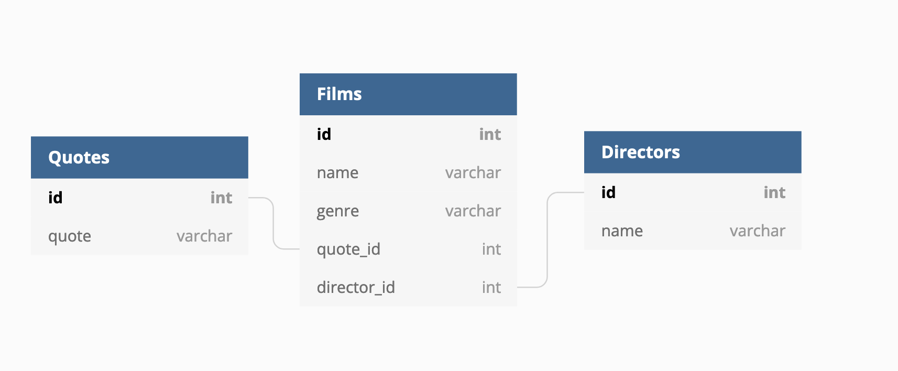
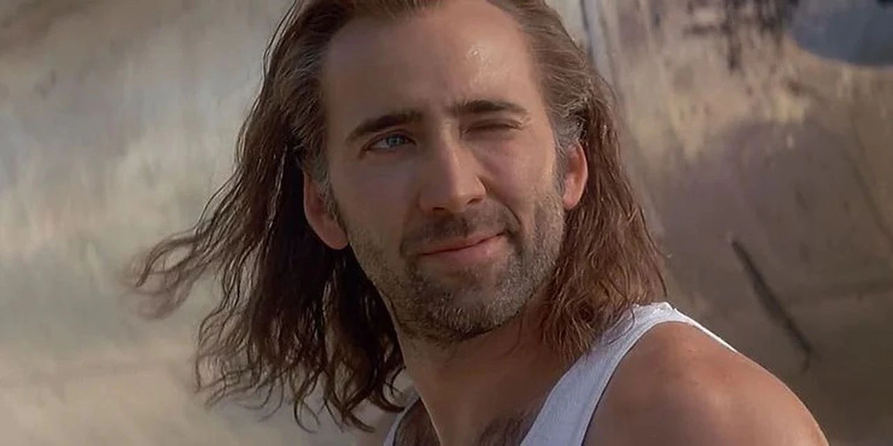

# knex-joins-stories

User stories to implement when practising joins

## Installation

Clone this repo, `cd` into the new directory and then:

```
npm i
npm run knex migrate:latest
npm run knex seed:run
npm run dev
```

This will create and populate the database with the existing migrations and seeds, and start the server with `nodemon`.

## Intro!!
From highly respected leading man to B-Movie god we've decided to take inspiration from Nic Cages' versatile film career to help you get comfortable and more N-Caged with joins! 



## Start with:

- _As a user, I would like to see a list of Nicolas Cage `films` so that I can see all the great films he's been in._

- _As a user, I would like to visit a `view` route for an individual film that shows the film name, genre and director so that I can see who directed these great Nicolas Cage films._
   - This will need a join between `films` and `directors`.

- _As a user, I would like to visit a `quotes` route. This should show a list of films and the best quote from each film._
   - This will need a join between `films` and `quotes`.
   - There is no `quotes_id` in `films`, so you'll need to make a new migration to add a column to that table (and you'll also need to add data for that new column into your seed data. See how we implemented something similar for directors).


That's MVP! If you're done already, choose some of the stories below.


## Stretch stories:

- _As a user, I would like to add films to the films table (including their genres) so that we have more Nicolas Cage movie goodness for us all to look through._

- _As a user, I would like to delete films from the films table if I think they don't belong on this list of greatness._

- _As a user, I would like to modify a films's director because I know only one Coen Brother is credited as a director for Raising Arizona._

- _As a user, I would like to change a films's quote as I know that Con Air has the brillant `Put... the bunny... back... in the... box.` quote._

- _As an administrator, I would like to add new quotes because there are too many excellent quotes to choose from._

- _As an administrator, I would like to add new directors because Nicolas Cage works with all the best directors in the movie business._

- _As an administrator, I would like to add awe inspiring images of Nicolas Cage, try adding a new images database table_ 

- _You may have noticed the public folder contains some excellent images of Nicolas Cage and a basic CSS file. The images are named after the film ids. You can use these any way you like on the site! You can implement them by using the film ID in handlebars to build up an `` tag. You could then create a CSS file so you can structure them in a layout._

## [Db Diagram](https://dbdiagram.io/)
```
Table Films {
  id int [pk, increment]
  name varchar
  genre varchar
  quote_id int
  director_id int
}

Table Quotes {
  id int [pk, increment]
  quote varchar
}

Table Directors {
  id int [pk, increment]
  name varchar
}

ref r7: Films.quote_id > Quotes.id
ref r8: Films.director_id > Directors.id
```
